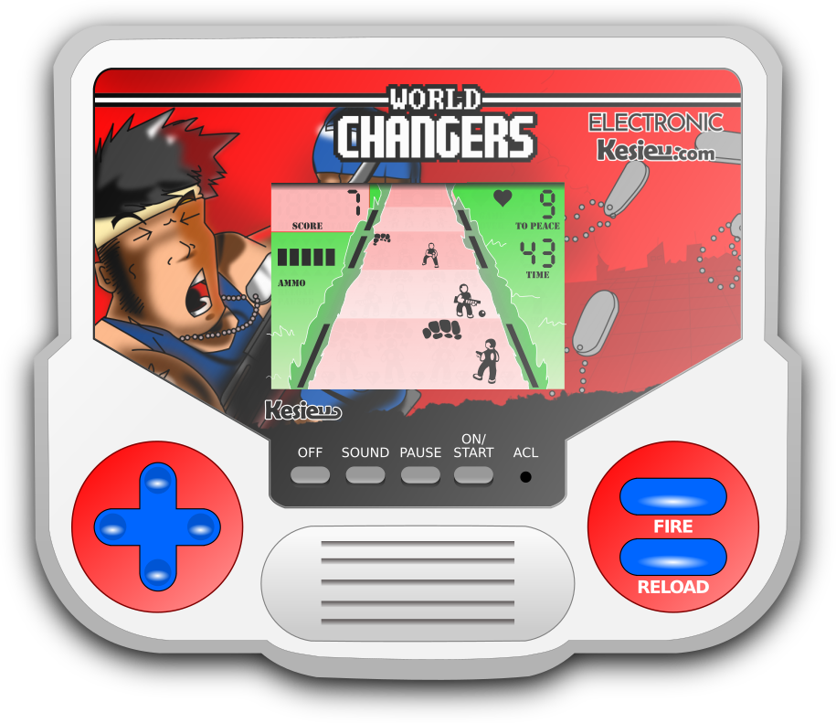
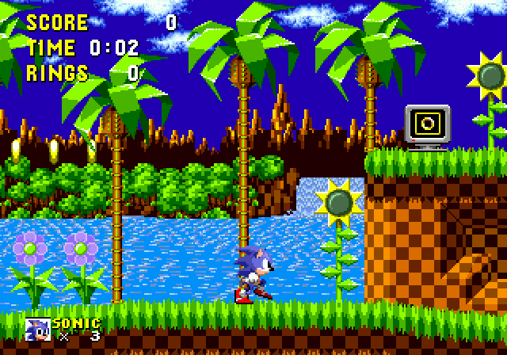
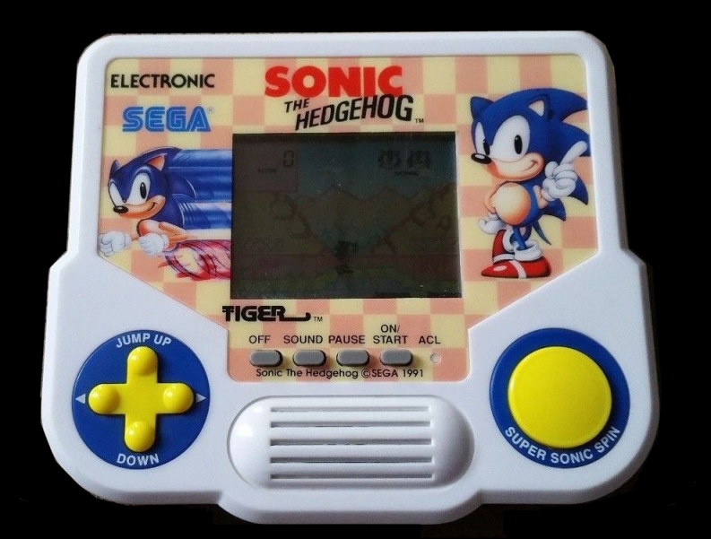
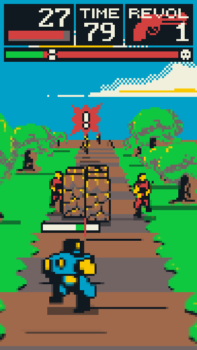
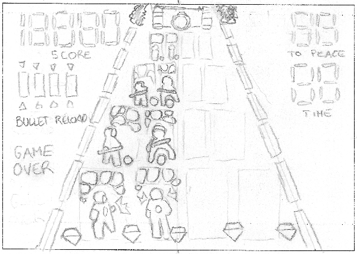
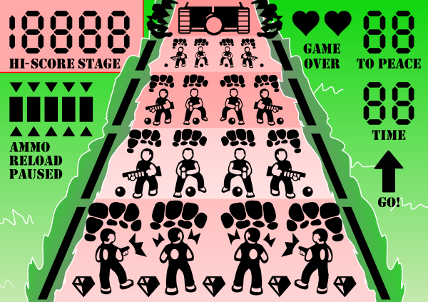

# LCD Game - World Changers

    

---

    <a href="https://www.kesiev.com/lcdgame/">Play!</a> 

---

**LCD Game - World Changers** is a simulator of a never existed physical LCD handheld conversion of **[World Changers](https://github.com/kesiev/wc)**, an action game inspired by old classics, like Cabal, Contra, and OutRun, and modern games like Gears Of War and mobile casual gaming. In a way is a *demake* (of World Changers) *of a remake* (of Cabal, Contra, and OutRun) *of a demake* (of Gears Of War).

## Story

The world is not *right* and that's not good! Try to change it as it should be using the most effective tools humanity invented - according to *the best people* in history!

Take down enemy soldiers and huge tanks, collect diamonds and bring *peace* to Earth once and for all... or (most probably) die trying!

## Gameplay & Controls

   - Hit F or click/touch the game display to fullscreen the game
   - Use the arrow keys or click/touch the arrow controls to move your soldier
   - Hit Z or click/touch the FIRE button to fire
   - Hit X or click/touch the RELOAD button
     - Hit the RELOAD button again when the arrows are aligned with the top of the bar for a perfect reload!
   - Eliminate the required amount of enemies in time or... game over!
   - You can hide behind the walls on the bottom of the screen...
   - ...but enemies can do the same with the walls far from you!
   - Don't forget to collect the diamonds!

## Why? A Christmas story.

When I was a kid my father was a huge home computer fan and, when I asked for a gaming console, he used to answer *"Why do we need a console if we have a system that does more?"*. But there was a [SEGA Genesis](https://en.wikipedia.org/wiki/Sega_Genesis) (the SEGA Megadrive here in Italy) game I had seen at my friend's home that blew my mind and I was super-sure that would never be on our [Commodore 64](https://en.wikipedia.org/wiki/Commodore_64): [Sonic the Hedgehog](https://en.wikipedia.org/wiki/Sonic_the_Hedgehog).

    

    
Sonic the Hedgehog for the SEGA Genesis

I was so into that game that I kept stressing my parents about Sonic every week. One day, around Christmas, I managed to convince them to buy me _something to play Sonic_ that was cheap enough to _justify the purchase_ in some way. Unsurprisingly, It was the infamous [Tiger Electronics](https://en.wikipedia.org/wiki/Tiger_Electronics) adaptation of the game.

    

    
Tiger Electronics Sonic the Hedgehog adaptation

The game was _quite bad_: the crisp colorful graphics were gone, the sense of speed was missing, and the great music and sound effects were just bleeps and bloops... but still _I loved that game_. Maybe at that time, I had enough creativity to see the little traces of _Sonic_ that were in that game. Maybe I had learned to enjoy what I had without asking for more.

But now, as an adult, I've to admit that porting _anything of Sonic_ into a tiny LCD game has probably been a _desperate mission_ for the Tiger Electronics programmers and engineers.

So, this Christmas, I want to pay a little tribute to all those who try despite the limits, despite the results, and despite everything. I want to go down the _desperate_ creation process of injecting a little of another game into an LCD game - even if I'm well aware that's way easier to make a simulator in 2022 than the real thing in 1991. So I've chosen **World Changers**...

    

    
The original World Changers

... distilled its key features to the paper mockup...

    

    
The LCD Game World Changers mockup on paper

... scanned it to make the vector image of the LCD...

    

    
The LCD Game World Changers display

... and coding this game. It has been a nice trip! Thank you for reading this far and, if it suits for these days, Merry Christmas!

## Credits

### Thanks

  - [Bianca Brenna](http://www.linearkey.net/)
